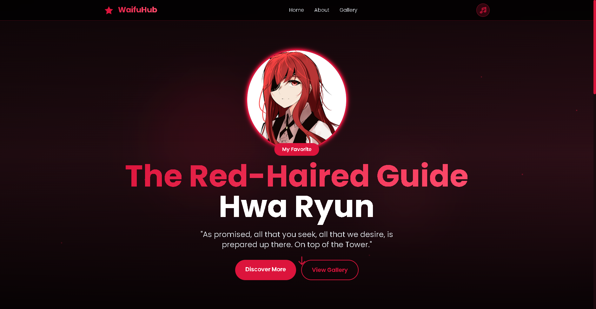
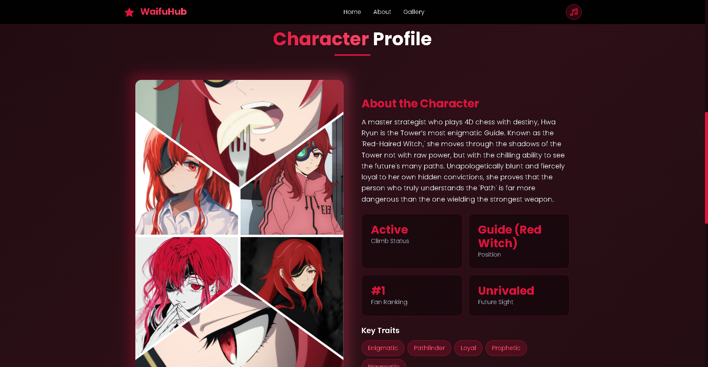
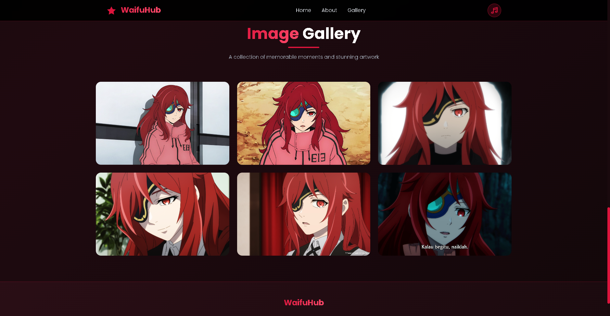

# 🌹 Hwa Ryun: The Red-Haired Guide

A high-performance, visually striking landing page dedicated to **Hwa Ryun**, the enigmatic strategist from the *Tower of God* series. This project showcases a modern "Dark Crimson" UI/UX design with smooth animations and a responsive layout.



## ✨ Features
* **Custom Crimson Theme:** A curated color palette designed specifically to match Hwa Ryun's aesthetic.
* **Interactive Gallery:** A sleek image grid with hover effects and a built-in Lightbox for high-res viewing.
* **Smooth Motion:** Custom Tailwind animations including floating elements, fade-in-on-scroll, and glow effects.
* **Fully Responsive:** Optimized for desktop, tablet, and mobile viewing.
* **Background Ambience:** Integrated music controller with a custom UI toggle.
* **Glassmorphism:** Modern blurred-background navigation and profile cards.

## 🛠️ Tech Stack
* **HTML5 & CSS3:** Semantic structure and custom styling.
* **Tailwind CSS:** For the utility-first styling and responsive grid system.
* **JavaScript (Vanilla):** Logic for the music player, image lightbox, and scroll observer animations.
* **Google Fonts:** Utilizing 'Poppins' for a clean, modern look.

## 🚀 Quick Start
1.  **Clone the repository:**
    ```bash
    git clone [https://github.com/YourUsername/hwa-ryun-web.git](https://github.com/YourUsername/hwa-ryun-web.git)
    ```
2.  **Open the project:**
    Simply open `index.html` in your favorite browser.

## 📸 Screenshots
| Profile Section | Image Gallery |
| :--- | :--- |
|  |  |

## 🎨 Design Philosophy
The goal of this project was to move away from generic anime fan pages. Every element—from the particle background to the specific "S-Rank" stat cards—was designed to reflect Hwa Ryun's status as a master strategist.

---
*Created with ❤️ for the Tower of God community.*# hwaryun
